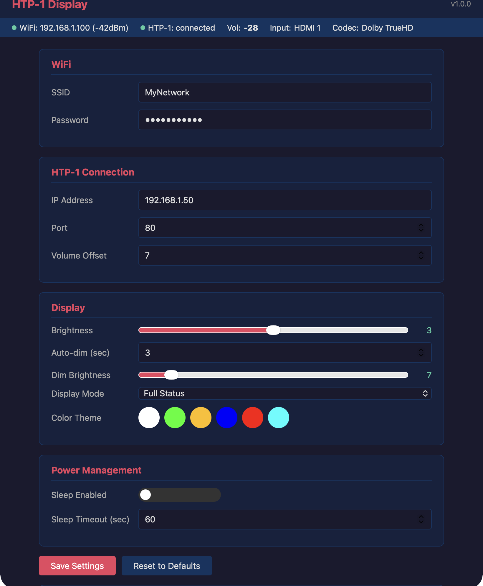

# Monolith HTP-1 Volume Display

A volume display for the [Monolith HTP-1](https://www.monolithusa.com/) audio processor using the [LilyGo T-Display-S3 AMOLED](https://www.lilygo.cc/products/t-display-s3-amoled) (536x240, ESP32-S3).

Connects to the HTP-1 via WebSocket and displays real-time volume, input source, codec info, and more on the AMOLED screen. Configurable through a built-in web interface.

## Features

- **Real-time volume display** with configurable reference level offset
- **4 display modes**: Volume Only, Volume + Source, Volume + Codec, Full Status
- **6 color themes**: White, Green, Amber, Blue, Red, Cyan
- **Input name mapping** — assign friendly names to HTP-1 input codes (e.g. `h1` → "Apple TV") via the web UI
- **Mute/standby indicators** — red MUTE overlay and STANDBY label
- **Codec abbreviation** — long codec names are automatically shortened (e.g. "Dolby TrueHD (ATMOS)" → "TrueHD Atmos")
- **Web configuration UI** — dark-themed responsive page for all settings
- **OTA firmware updates** — upload `.bin` files through the web interface
- **Auto-dim** — configurable timeout dims the display to save power, wakes to full brightness on volume change
- **Sleep mode** — display turns off after extended idle, wakes on new data or button press
- **Dual data sources** — WebSocket for real-time updates + HTTP polling every 3s for full state refresh
- **WiFi AP fallback** — if WiFi connection fails, starts a `HTP1-Display-Setup` access point for initial configuration
- **mDNS** — reachable at `http://htp1-display.local/`
- **Persistent settings** — all configuration saved to NVS flash (input names, themes, brightness, etc.)
- **Auto-reconnect** — reconnects to HTP-1 automatically on disconnect (5s retry)

## Hardware

- [LilyGo T-Display-S3 AMOLED](https://www.lilygo.cc/products/t-display-s3-amoled)
- Button 1 (GPIO 0): short press = cycle brightness, long press = cycle display mode
- Button 2 (GPIO 21): short press = cycle dim brightness, long press = toggle sleep

## Display Modes

Cycle modes with a long press on Button 1, or select from the web UI.

| Mode | Layout |
|------|--------|
| **Volume Only** | Full-screen volume number (7-segment font, 240px tall) |
| **Volume + Source** | Input name at top, volume below |
| **Volume + Codec** | Volume at top, codec/format at bottom (auto-shrinks if too wide) |
| **Full Status** | Input + codec on top row, volume in center, surround mode + listening format on bottom row |

All modes show a red **MUTE** label when muted and a **STANDBY** label when the HTP-1 is powered off. If input name mappings are configured, friendly names are shown instead of raw HTP-1 codes in all modes that display the source.

## HTP-1 Data

The display reads the following fields from HTP-1 via WebSocket (`msoupdate` patches) and HTTP (`/ircmd` polling):

| Field | WebSocket Path | HTTP (`/ircmd`) Key |
|-------|---------------|---------------------|
| Volume | `/volume` | `volume` |
| Muted | `/muted` | `muted` |
| Input Label | `/inputLabel` | `input` |
| Codec | `/status/DECSourceProgram` | `status.DECSourceProgram` |
| Program Format | `/status/DECProgramFormat` | `status.DECProgramFormat` |
| Surround Mode | `/status/SurroundMode` | `status.SurroundMode` |
| Listening Format | `/status/ENCListeningFormat` | `status.ENCListeningFormat` |
| Power State | `/powerIsOn` | — |

## File Structure

The refactored project lives in `HTP1_Display/` (Arduino IDE requires all files in a flat directory named after the `.ino`):

| File | Purpose |
|------|---------|
| `HTP1_Display.ino` | Main sketch — WiFi, AP fallback, mDNS, power management |
| `config.h` | Pin definitions + app defaults (brightness, timeouts, version) |
| `settings.h / .cpp` | `AppSettings` struct with NVS persistence via Preferences |
| `display_manager.h / .cpp` | Rendering for 4 display modes + 6 color themes |
| `htp1_client.h / .cpp` | WebSocket client, JSON parsing, auto-reconnect |
| `button_handler.h / .cpp` | Debounced buttons with short/long press detection |
| `web_server.h / .cpp` | ESPAsyncWebServer — settings UI, status API, OTA |
| `web_ui.h` | PROGMEM HTML/CSS/JS for the web config interface |
| `rm67162.h / .cpp` | AMOLED display driver (RM67162, QSPI) |

The original single-file sketch is preserved in the root as `LilygoAMOLED_websockets_working.ino`.

## Dependencies

- [ESPAsyncWebServer](https://github.com/me-no-dev/ESPAsyncWebServer) + [AsyncTCP](https://github.com/me-no-dev/AsyncTCP)
- [ArduinoJson](https://github.com/bblanchon/ArduinoJson) v7
- [TFT_eSPI](https://github.com/Bodmer/TFT_eSPI)
- [ESP8266-Websocket](https://github.com/morrissinger/ESP8266-Websocket) (WebSocketClient)
- Built-in: WiFi, Preferences, Update, ESPmDNS

## Setup

1. Flash the `HTP1_Display` sketch to your T-Display-S3 AMOLED
2. On first boot (no saved WiFi), the device starts an AP named **HTP1-Display-Setup**
3. Connect to the AP and open `http://192.168.4.1/` in a browser
4. Enter your WiFi credentials and HTP-1 IP address, then save
5. The device reboots, connects to WiFi, and begins displaying volume
6. Access settings anytime at `http://htp1-display.local/` or the device's IP

## Web Interface

The built-in web UI provides:

- **Live status bar** — WiFi signal strength, HTP-1 connection, current volume/input/codec
- **WiFi settings** — SSID and password
- **HTP-1 connection** — IP address, port, volume offset
- **Input names** — map HTP-1 input codes to friendly display names (up to 8 mappings)
- **Display controls** — brightness slider, auto-dim timeout and brightness, color theme picker, display mode selector
- **Power management** — sleep enable/disable and timeout
- **Firmware update** — drag-and-drop `.bin` upload with progress bar

### REST API

| Endpoint | Method | Description |
|----------|--------|-------------|
| `/` | GET | Web configuration UI |
| `/status` | GET | Live JSON status (WiFi, HTP-1 connection, volume, input, codec) |
| `/settings` | GET | Current settings as JSON (password redacted) |
| `/settings` | POST | Update settings (JSON body), returns `{"ok":true}` |
| `/update` | POST | OTA firmware upload (multipart form with `.bin` file) |
